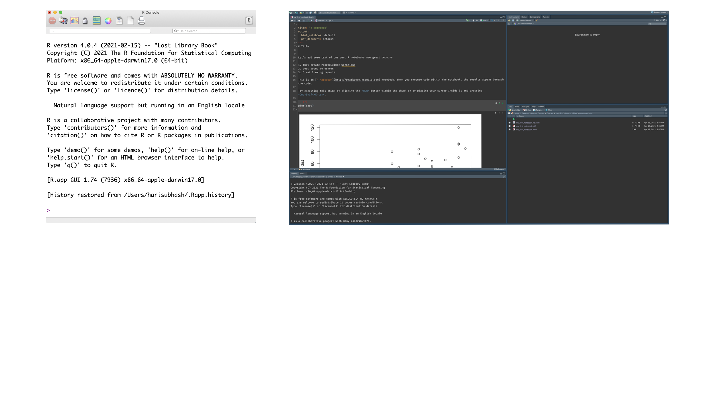
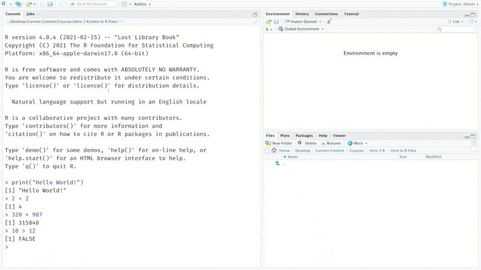
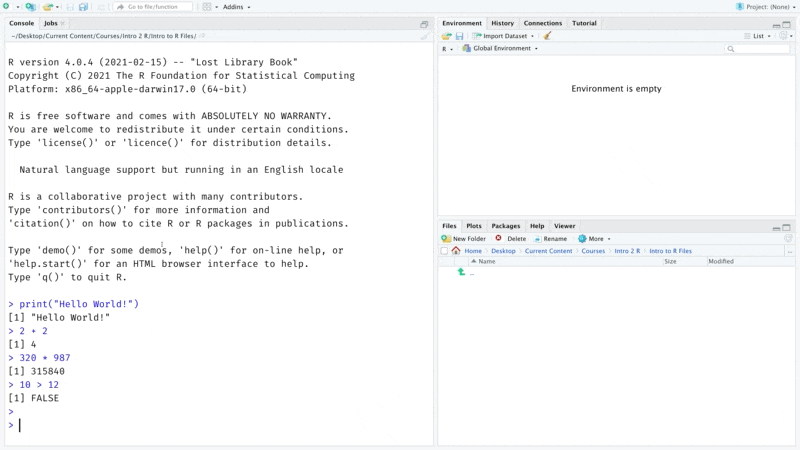
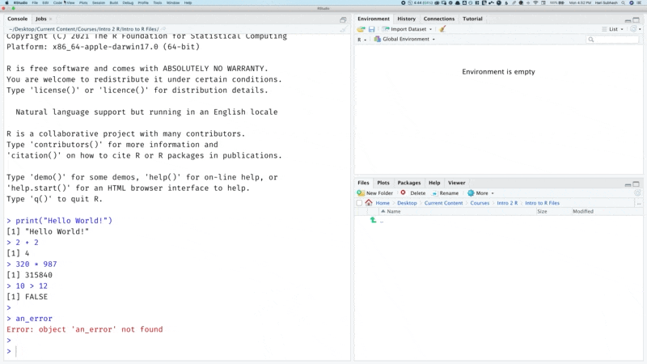
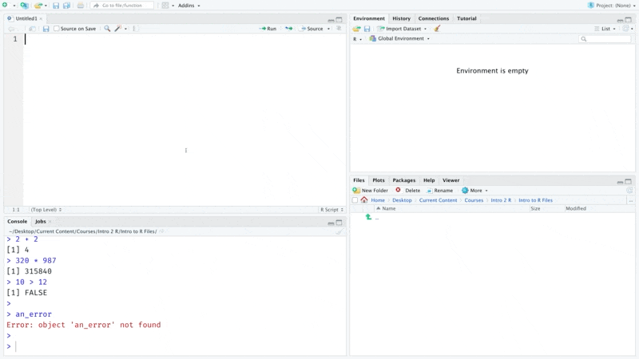
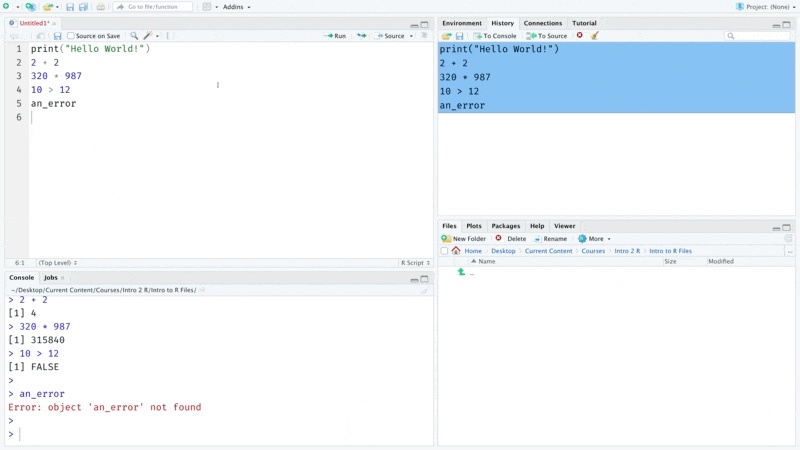
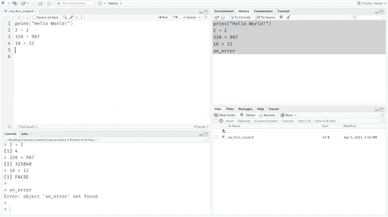
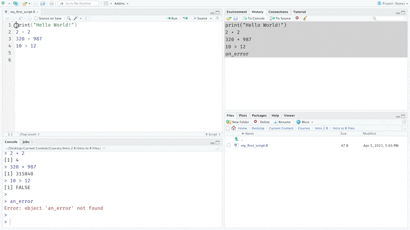
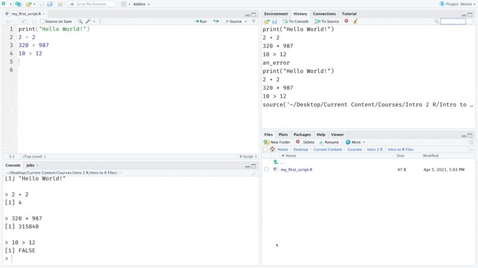
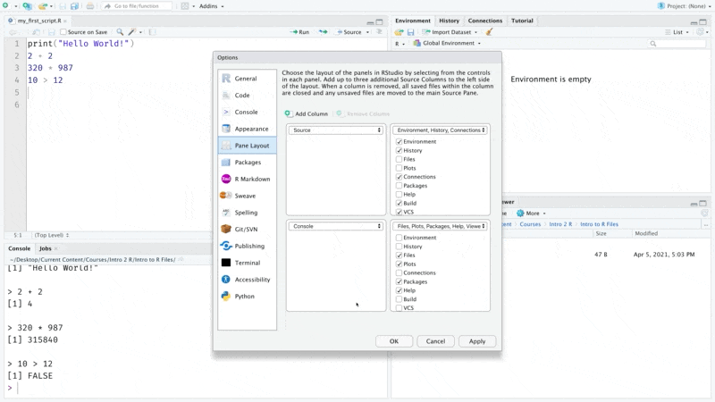

# Setup R and RStudio {#setup}

In this chapter, we will install R and RStudio and get familiar with executing some code.

## Install R
Our very first step is to download and install R. The sequence below is current as of August 2021. [CRAN](https://cran.r-project.org/), which is an open repository for R content, hosts installation files for R across different servers located around the world. I am based out of the US so I will pick one from here but you could use any of the options here to download R.  On the next screen, pick the version that corresponds to your operating system and install it on your machine.

```{r echo=FALSE}
knitr::include_graphics("assets/ch_1-setup/gifs/download_r.gif")
```

Once R is installed on your computer, your machine would be able to understand and execute any code that you write in R. 

## Install RStudio
R comes with a basic editor for writing code. But we won’t use it in this book.  Instead we will use RStudio. 

You can think of R Studio as a fully featured editor like Microsoft Word or Google docs, while the basic editor that ships with R is like the notepad or any other basic text editor. The community version of RStudio is free and packed with features that make our lives easier.

<!-- ```{r echo=FALSE} -->
<!--  -->
<!-- ``` -->

You can download RStudio from the following [link](https://www.rstudio.com/products/rstudio/download/#download). Once you have R Studio installed, open it up to write your first few lines of code.

## Run commands in the console
Let’s print(“hello world”) as our first command. 

```{r eval=FALSE}
print("Hello World!")
```

The right angle bracket with blinking cursor shows the place where we can enter commands. You should follow along with the next sequence of steps so that you get familiar with typing commands in R.
```{r echo=FALSE}
knitr::include_graphics("assets/ch_1-setup/gifs/hello_world.gif")
```

Let's try out a few basic arithmetic operations. Enter the arithmetic as shown below one line at a time.

```{r eval=FALSE}
2 + 2
320 * 987
10 > 12
```

You can think of the R console as a calculator on steroids. Similar to the calculator it allows us to enter commands and it prints the results of those below the command.

```{r echo=FALSE}

```

## Dealing with errors
Computers, unlike humans are extremely finicky and precise about language. While humans can infer meaning from jumbled up words or incomplete sentences; computers will protest and complain even if a period is not where it is supposed to be. This means that at some point we will invariably type in something that yields an error. When that happens R will return an error message like the one shown below that indicates why there was an issue with executing a particular line of code.

```{r echo=FALSE}

```


Errors can be frustrating experience if you are new to coding. You might not immediately be able to tell why an error occurred and the error message from R can often seem very cryptic. 

Errors, however, are a part and parcel of programming. And a big component of your journey as a new programmer will be to learn how to understand and resolve them. The first and often best strategy is to copy paste the error message and search on google to see if others have resolved the same error with someone else. Initially even these solutions like those on forums like [stackoverflow](https://stackoverflow.com/questions/14469486/r-issue-object-not-found) might seem hard to decipher and understand. But, eventually you will get to a point where you are not as flustered when you encounter them and have enough knowledge, tools and strategies in your arsenal to troubleshoot effectively. You might even come to enjoy the puzzle solving learning experience that an odd error brings 😄.

I will deliberately introduce several errors as we go through this book to get us familiarized with them and teach you how to go about resolving them.  

## Saving code
So far, we have typed commands into the console. But you will notice that there is no option to save the code that we have typed into the console. Most projects would require files that can be saved so that we can work on them over a period of time and execute them a multiple times without having to type them out each time. 

We can do this by placing code inside a file. There are many different types of files but, for now let’s start with a simple R script.

```{r echo=FALSE}

```

Now we need to get all the commands that we tried out earlier into this script. One option would be retype all the commands but that is an extremely tedious way of doing this. Instead, we can access all the previously executed code using the history tab as shown below and copy it over to the source file. 

```{r echo=FALSE}

```

We don't need the line that generated the error, so let's remove that and save the file. I am calling it my_first_script. But you can call it anything you want.

```{r echo=FALSE}

```

The files tab in RStudio shows all your files and folders. Navigate to the folder you saved the script in to check if it is actually there.

```{r echo=FALSE}

```

## Executing a script
Once you have saved your file, you can run it as many times you would like without having to retype any of the commands. There are two ways you can do this. The first is by stepping through the script one line at a time using the run button.

```{r echo=FALSE}

```

The second is by running the full script by sourcing the file. You can do this by clicking on the source button. Notice that the source command generates a new line in the history tab. This is the command that is used to source a file. Now we can close the script and paste this command from the history tab using the `To console` button and run it to execute all of the code within that script as shown below. Also notice how I use the broom `r emo::ji('broom')` icon to clear the code in the console before sourcing the script. 

```{r echo=FALSE}

```

## RStudio look and feel
RStudio comes with tons of options to customize how it looks and feels. You can customize the different tabs, choose a different font, apply a darker theme etc. I personally like a dark theme, so I am going to switch over to that for the rest of this book.

```{r echo=FALSE}

```

