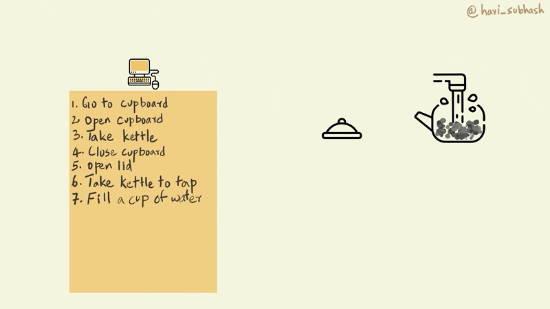
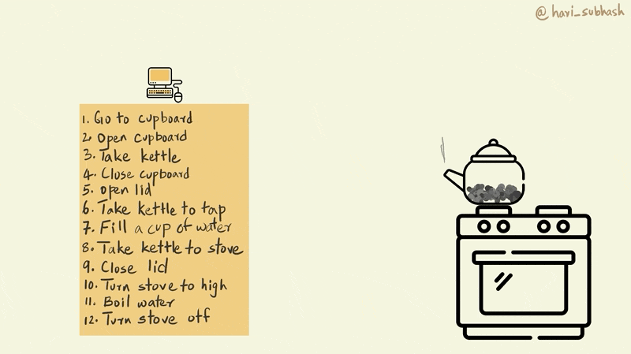
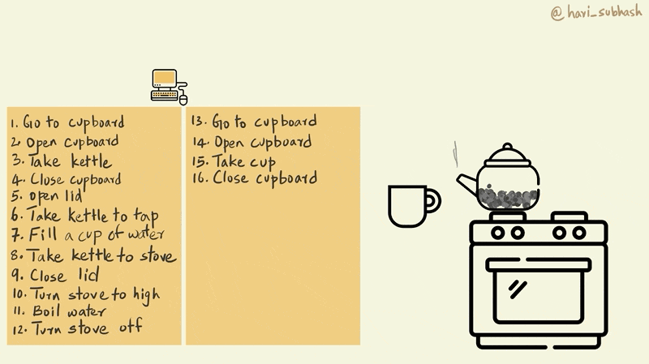
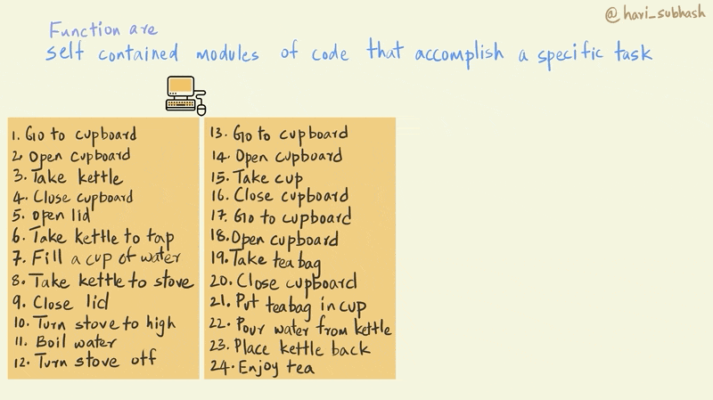
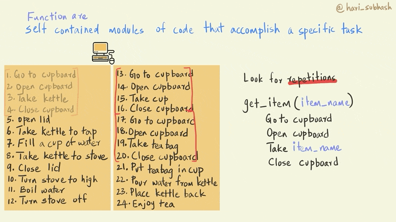

# Introduction to Functions

In chapter \@ref(setup) section on [saving code] we saw how we could save a series of programming commands in a script and then source that script whenever we needed to execute the same sequence. This meant that we did not have to type out the commands again to execute the series of steps, instead, we could simply source the script to run the sequence of steps for us.

Functions are a similar concept in programming but with the additional feature of being able to pass certain values as arguments that determine the nature of the output.

For instance, consider the following function `sum(32, 15)`. `sum` is the name of the function and `32` and `15` are the arguments that were passed to the function. If we changed the values of the arguments to some other numbers then the output of the sum function would change accordingly.

We'd similarly used the `print` function earlier with the argument `"Hello World"`. In programming terminology, whenever we use a function in our code it is referred to as being called with its arguments. Here we called the function print with the argument "Hello World".

```{r echo=FALSE}
knitr::include_graphics("assets/ch_3-functions/gifs/functions_syntax.gif")
```

Functions are an extremely powerful tool for programming and have a lot of different benefits.

Well named functions enhance the readability of your code by declaring to the reader what it is that you are doing. When a programmer uses functions like `sum` or `print`, the reader clearly understands what they are seeking to achieve. This is in contrast with a series of commands that implement the nitty-gritty details of adding two numbers or printing something to the console, which often are confusing to someone else who is not necessarily familiar with the logic behind the detailed steps.

By encapsulating a series of steps in a function, you also reduce the likelihood errors that could occur if you had to copy and paste the same set of commands in different places in your code. Eliminating the need to copy paste commands also makes your code much easier to manage, since if you realize you have to modify a particular command you only have to do it within the function definition, whereas if you did not use a function, you would have to find all the places where that command appears and then change all those instances.

## An illustration

Let's explore why functions are useful and how to go about building them by teaching a computer to make tea. Imagine this computer is sending these instructions to a robot.

Now, asking your computer to make tea is very different from say asking a friend of yours to make you tea.

Your friend doesn't need step by step instructions to make tea. In fact your friend would probably think that you were crazy if you told them something like "put the kettle on the stove and wait for the water to come to a boil and then open the cupboard to get a cup". You would instead simply declare, make me some tea (please). Much like you declared print "Hello World" for me.

Unlike your friend a computer needs very precise step by step instructions to make tea. So let's look at two ways to provide this instruction. One without functions and another using functions.

Let's start by turning on our computer and asking it to boil some water for the tea.

First you need to get the kettle from your cupboard.This would involve going to the cupboard, opening it, and then pulling out the kettle from the cupboard and then closing the cupboard.

```{r echo=FALSE}

```

Next you will need to fill water in the kettle for a cup of tea. This involves going to the tap and filling enough water for a cup.

```{r echo=FALSE}

```

Next let's give instruction to boil this water.

```{r echo=FALSE}

```

Now that we have boiling water, we need to go back to the cupboard to get a cup to pour the water into.

```{r echo=FALSE}

```

Now, the only thing missing is a tea bag. Let's go back to the cupboard to fetch that as well.

```{r echo=FALSE}

```

Now we need to place the teabag in the cup and pour the water in.

```{r echo=FALSE}

```

Enjoy your tea!

## The function way

Functions can be defined as follows [@function_def]

> Functions are self contained modules of code that accomplish a specific task

So how do we recognize when to use a function in our code???

The biggest hint that you can get for using a function is when you notice yourself copying and pasting code from one part of your script or notebook to another. This is usually a signal to stop and consider if it is worth the effort to encapsulate that particular sequence into a function. For instance, in our series of steps for the computer, the sequence where we go to the cupboard to fetch something is repeated and can be replaced with a function.

```{r echo=FALSE}

```

Let's create a function called get_item that takes the item that we would like to get from the cupboard as its argument. Notice how in the function definition, for step 3, where the computer needs to take a particular item, we use `item_name` instead of a specific item like a kettle or a cup as we did previously. This is the key design feature of functions that allows us to use it repeatedly with different parameters.

```{r echo=FALSE}

```

Now we can replace all the repeated cupboard sequences with our `get_item()` function. And instead of the item_name, we use the name of the specific item that we would like to fetch from the cupboard and internally the function will replace item_name with the name of the item that we pass as an argument for the function. So get_item("cup") will fetch a cup from the cupboard.

```{r echo=FALSE}

```

Now that we have replaced the repeated sections, we can clean up our code a little bit. The code is now much smaller and easier to understand.
```{r echo=FALSE}
knitr::include_graphics("assets/ch_3-functions/gifs/clean_code.gif")
```

## More functions
Now imagine if you were instead teaching the computer to cook. And making tea was one of the many other things that are included in this huge program. Some of the sequences in making tea, such as that for boiling water or putting an item into a vessel etc. are also likely to be repeated elsewhere. How would you write a function to encapsulate these actions?

