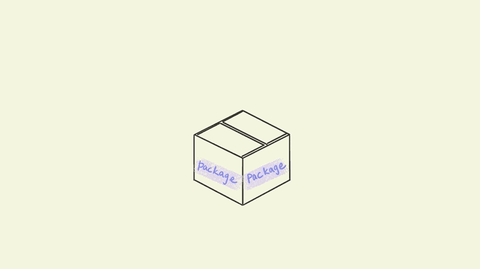
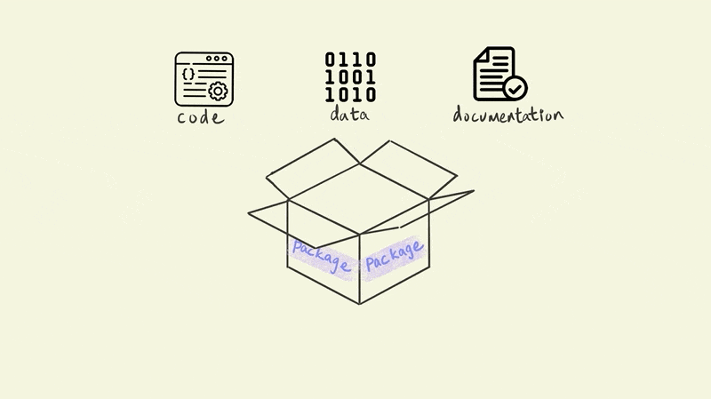
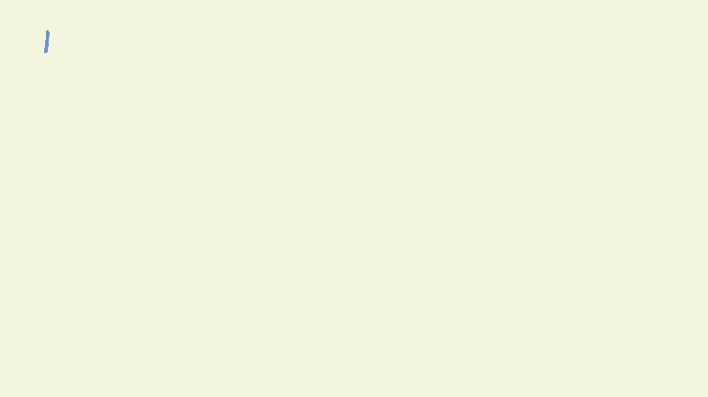
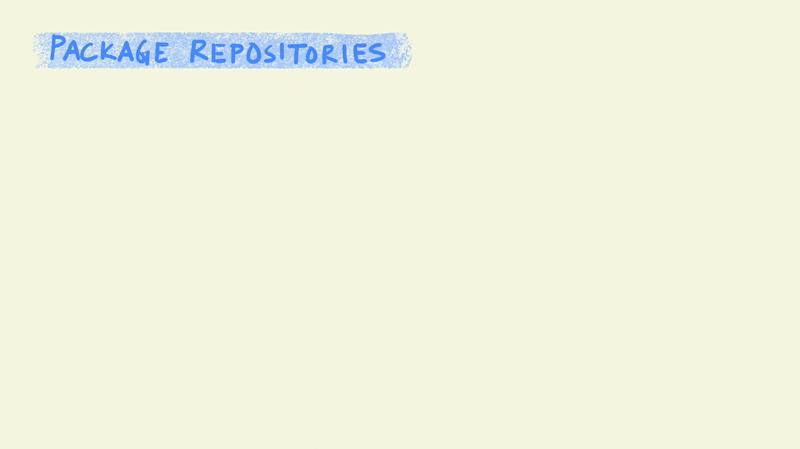
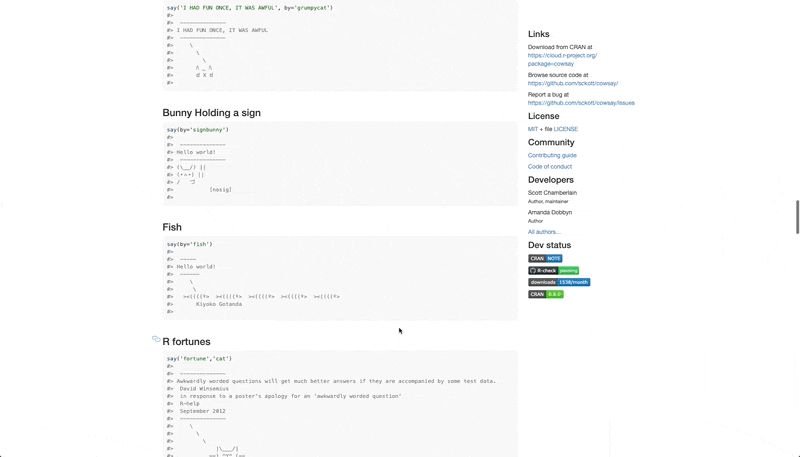
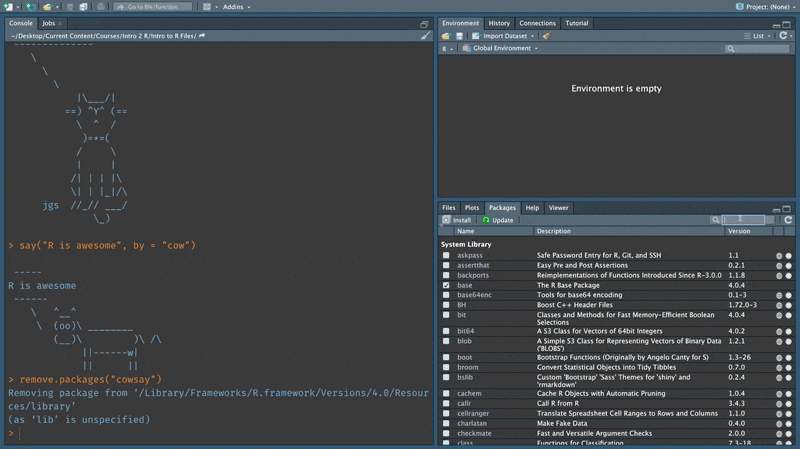
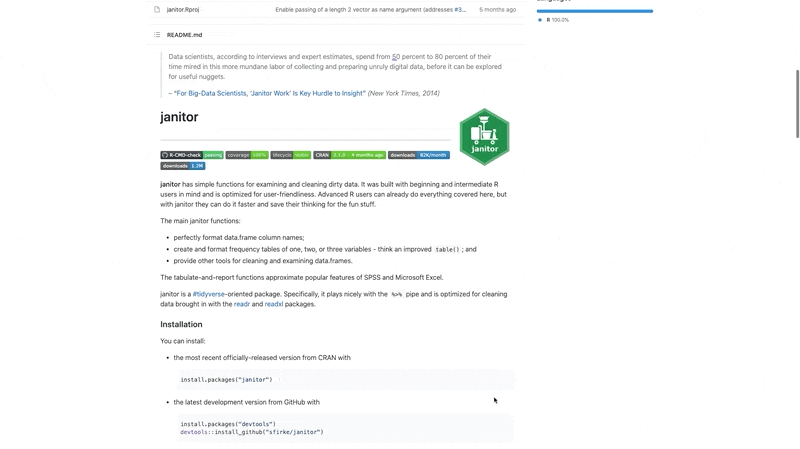

# Appendix

## Packages
One of the biggest benefits of using an open source language like R is its robust package ecosystem. Now, if the only packages that you know of are the ones that get delivered by your mail person, then stick around. This chapter will cover how to install, use, uninstall and find packages. Let’s start by understanding what packages are and why they are so great.

### What is a package?
A package usually contains code, data and documentation.

```{r echo=FALSE}

```

The code part usually contains a set of functions that we can use in our work. In Chapter \@ref(functions-intro), we discussed how functions allow us to encapsulate a series of operations. This function can then be repeatedly called to execute the same sequence of steps. Packages contain a collection of such functions that have been written and tested by someone else.

```{r echo=FALSE}

```

### Why are packages useful?
Packages, can save us a tremendous amount of time and effort when conducting data analysis. Let's see how.

Imagine you are researching software stocks to invest in. You specifically want to examine past trends in price movement to predict the future.

```{r echo=FALSE}
knitr::include_graphics("assets/packages/gifs/stock_qstn.gif")
```

To do this research, you will first need to download historical price data for different stocks from a website or service like Yahoo Finance or Morningstar.

```{r echo=FALSE}

```

Often, the downloaded data has errors, might be incomplete, and in a shape that is not suited for the analysis that you want to perform. So the first task is usually to tidy this data so that it is in a format that you can use. For instance, in the case shown below I transform the data from a wide format with stock names as columns to a long format where the stocks are represented as rows. There is a lot more to tidying data, which we will cover in chapter \@ref(tidy-data).

```{r echo=FALSE}
knitr::include_graphics("assets/packages/gifs/tidy.gif")
```

The actual work that draws meaningful insight from the data often happens in an iterative manner. Very rarely do we find our answers in the first try and it often requires a series of steps that combine visualization, analysis and modeling and further transformations of the data till we can draw conclusions. 

```{r echo=FALSE}
knitr::include_graphics("assets/packages/gifs/make_sense.gif")
```

Once we have some conclusions that we can share, we can communicate these results. In a collaborative setting you would also need to communicate intermediate results with your research partner(s). So in these settings, communication can also be wrapped into the earlier iterative process of making sense of the data. 

```{r echo=FALSE}

```

Packages help simplify all of these steps. Most tasks and problems that you encounter in your analysis are likely to have already been resolved in a different setting by someone else. For instance, consider the task of getting data from Yahoo Finance, someone else has probably done this using R before. Packages are a way to bundle these solutions along with some documentation so that you don't have to reinvent the wheel when solving the same problems again.

For example, in our case, the [tidyquant](https://business-science.github.io/tidyquant/) package contains a lot of functions for financial analysis. These can be used to directly download data from Yahoo Finance (or other sources), run popular financial models and visualize them. Similarly, other packages such as tidyr, ggplot, dplyr etc. provide general purpose tools and frameworks that can be applied to any data analysis project. And finally, packages like Rmarkdown and knitr make it really easy to communicate your results in a compelling manner in a wide variety of formats. 

```{r echo=FALSE}

```

In a world without packages, you would need to write all the code needed to perform every step of your analysis. This would mean, code to download the stock data, clean it up, custom code to create financial models that you want to use, code for the analysis itself, and generating the charts and tables to include in a report or presentation to communicate the results.

The bulk of your intellectual work should be on analyzing whether a stock is a good investment or not i.e. making sense of the data. And packages free up your time by giving you well tested and effective solutions for tasks that are tangential to this purpose so that you can spend all your time on tasks that matter. 

### Package Repositories
Before we install a package, let's understand how they are maintained. When someone writes a package, they would need to host somewhere on the internet so that others can access the package to install it. The place that a package is hosted is called a repository. So when we issue a command on our computer to install a particular package, the relevant package is retrieved from this repository and installed on our computer.

```{r echo=FALSE}

```


There are three main sources for r packages. The first and biggest one is the Comprehensive R Archive Network or CRAN. There are about 17500 packages on CRAN right now. The next one is called Bioconductor which specifically provides tools and packages for genomic data and analysis. The final category of packages are hosted independently with the most common choice being github which is a repository for code. 

Packages that are hosted on CRAN or on BioConductor have requirements about testing and maintenance that ensures the quality of the code. These requirements do not exist for packages that are hosted independently on platforms like GitHub.

CRAN and Bioconductor require package developers to maintain their packages and pass certain quality checks. Packages that are not maintained are periodically removed from these repositories. Independently hosted packages such as those on GitHub on the other hand do not have to pass any sort of checks. Package developers often use github to release the most latest versions of their packages on GitHub before moving them to repositories like CRAN.

```{r echo=FALSE}

```

Most of the packages that we will use are hosted on CRAN (unless your work is on Genomics). It is also often the case that packages that are hosted on CRAN are also available on GitHub. These usually tend to be the most recent version of a particular package that has not fully tested but might include newer functions that are not in the previous version that is on CRAN. 

```{r echo=FALSE}
knitr::include_graphics("assets/packages/gifs/repo_last.gif")
```

### Package documentation
Our first installation will be the `cowsay` package. This is a pretty whimsical package that prints a particular animal saying a phrase that you specify. In the code below, I am using the function `say()` from the `cowsay` package with the arguments "R can be pretty silly" and cat. This is printed out as shown below.

```{r}
library(cowsay)
say(what = "R can be pretty silly", by = "cat")
```

At the very minimum, packages that are published on CRAN must include an online reference that is in the pdf format. In a lot of cases, the package authors also provide additional reference websites and guides. In fact, the another package called [`pkgdown`](https://pkgdown.r-lib.org/) provides tools and functions that make it really easy to build websites for packages. The `cowsay` package has a website that is built using `pkgdown`. You can access it [here](https://sckott.github.io/cowsay/).

```{r echo=FALSE}
knitr::include_graphics("assets/packages/gifs/cowsay_scroll.gif")
```

Typically, the instructions to install a package are provided in the reference. As you can see, there are two suggested installation methods. The first is the version that is available on CRAN and the second is the newer development version from a repository on GitHub. 

```{r echo=FALSE}
knitr::include_graphics("assets/packages/gifs/install_box.gif")
```

The package documentation also includes links to external resources. 

```{r echo=FALSE}

```

Let's go to the page on CRAN for this package.

```{r echo=FALSE}

```

The CRAN page for a package includes all the meta data that is associated with a particular package. This includes links to the documentation, details about the package author(s) and the package references. One thing to note here is the list of dependencies. In most cases, a package depends on other packages to implement its functions. This is a key feature of an open ecosystem of packages. When doing anything in R you will most likely be depending on the work done by others and this holds true for those building packages as well. The dependencies for a particular package are installed along with the package if they don't already exist in your system.

```{r echo=FALSE}

```

### Install cowsay package
Type in the command below in your console (don't forget the quotes) and press Enter. This will install the cowsay package along with its dependencies.

```{r, eval=FALSE}
install.packages("cowsay")
```

The `install.packages` command is a function that is provided with R. When we provide it with the argument that specifies the name of the package it searches CRAN for this package and then downloads it onto our computer.

```{r echo=FALSE}
knitr::include_graphics("assets/packages/gifs/install_command.gif")
```

The packages tab on RStudio shows the list of all the installed packages on your computer.

```{r echo=FALSE}
knitr::include_graphics("assets/packages/gifs/package_tab_highlight.gif")
```

Try searching for the cowsay package after you have installed it to confirm that it worked.

```{r echo=FALSE}

```

Notice how the check box is unchecked. This indicates that the package has not been loaded yet for the current RStudio session. This means that you will not be able to directly use or refer to the functions or other items in this package right now. If we clear the search you will see the entire list of packages. Notice how some of them are already checked. These are the packages that are pre-loaded for every session of R. For instance, we were able to use the `print()` function earlier since it belongs to the base package that is pre-loaded.

```{r echo=FALSE}
knitr::include_graphics("assets/packages/gifs/packages_checked.gif")
```

We can load a package using the `library()` function. Copy the command below and run it in your console.

```{r eval=FALSE}
library("cowsay")
```

Once loaded use the `say()` function to print any message you like as shown below. By default, the  `say()` function uses a cat as the animal that say's the phrase.
```{r echo=FALSE}
knitr::include_graphics("assets/packages/gifs/howdy.gif")
```

We can use the `by` argument in the function to change this to a cow (or any other supported animals).
```{r echo=FALSE}
knitr::include_graphics("assets/packages/gifs/cowsay_awesome.gif")
```

Notice how we used multiple arguments in this function.

```{r echo=FALSE}

```

### Remove a package
We can remove a package using the `remove.packages()` command.

```{r eval=FALSE}
remove.packages("cowsay")
```

```{r echo=FALSE}
knitr::include_graphics("assets/packages/gifs/remove_package.gif")
```

`remove.packages()` however, will only remove the package that is specified and will not remove any of the dependencies. For instance, the fortunes package that was installed along with cowsay will still be available after removing cowsay.

```{r echo=FALSE}
knitr::include_graphics("assets/packages/gifs/dependency_not.gif")
```

Let's reinstall the cowsay package. This time we will use the install button that is available on the packages tab to perform the installation.

```{r echo=FALSE}

```

Notice how the install button simply calls the `install.packages()` function in the console.

```{r echo=FALSE}
knitr::include_graphics("assets/packages/gifs/bttn_install.gif")
```

### Install a package from GitHub
Janitor is a popular package that is used to clean data in excel spreadsheets after it has been loaded into R. Use this [link](https://github.com/sfirke/janitor) to access its GitHub repo. 

Not all r packages have an associated GitHub repository. And when they do, the authors typically use GitHub to host versions of a package that are not fully tested or mature yet. Since there are no regulations on what can be hosted on GitHub it is a good idea to pay attention to the stats which are displayed at the top of the repo. The higher these numbers the more likely that the package is of good quality. 

```{r echo=FALSE}
knitr::include_graphics("assets/packages/gifs/github_stats.gif")
```

GitHub is a online platform that offers extensive features for collaboration and version control for software projects. Repositories for R packages are usually open. This means that you can download the code that was used to create the package, submit issues or bugs, and even contribute to the code. 

```{r echo=FALSE}

```

Scroll down on the repo page to see instructions for how to install the package.

```{r echo=FALSE}

```

Copy the code that installs the latest version from GitHub.
```{r echo=FALSE}

```

Paste and run this in your RStudio console. This installs the devtools package which contains a function called `install_github()` that can be used to install packages from GitHub repositories. Notice, how we are again relying on a function from another package (devtools) to install a package. Without this, we would have had to write custom code to download and install a package from GitHub.

```{r echo=FALSE}
knitr::include_graphics("assets/packages/gifs/janitor_install.gif")
```

The janitor package comes with a lot of different functions that make it easy to clean and work with Excel files using R. We will be using these functions in chapter \@ref(tidy-data). Take a moment to scroll throught the repo page on GitHub to get a feel for them.

```{r echo=FALSE}
knitr::include_graphics("assets/packages/gifs/janitor_rest.gif")
```


