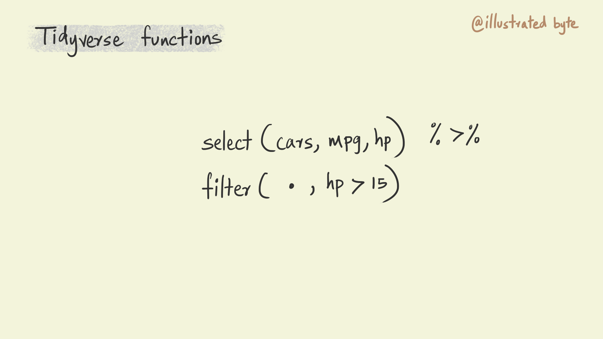
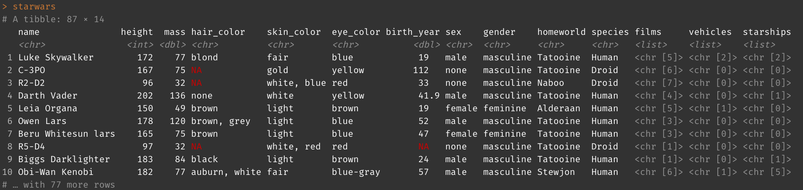

# Introduction to dplyr
dplyr is a package that belongs to the tidyverse that is used for manipulating data. Let's start by loading the tidyverse package into our environment.

```{r eval=FALSE}
library(tidyverse)
```

## Composing complex workflows using pipes
The ability to compose a complex task by piecing together much simpler functions is an important principle of the tidyverse. The pipe operator `%>%` is what connects all the simpler pieces. 

In a piped composition, you can think of each function doing some sort of operation on the data, the pipe than passes this transformed data to the next function. The illustration below shows a typical piped workflow. I have used shapes and colors as a way of representing data. Notice how the data is transformed in some manner in each step and then passed on to the next function in the composition. Each function on its own is doing something pretty simple but together then can be composed to perform really complex tasks.

```{r echo=FALSE}

```
A compositional approach to programming has several benefits. It is easier to write code in such a manner. Our brains work by breaking down complex tasks into smaller more manageable chunks. Code with simple and well named functions that are glued together using pipes is also easier to read and reason about thereby making it easier to collaborate and debug for errors.

The pipe is a fundamental piece of the tidyverse. It is the glue that holds it together. Now let's look a bit more closely at the anatomy of a tidyverse function.

### The anatomy of a tidyverse function
Most functions in the tidyverse follow the same pattern. The first argument in the function is `.data`. This explicitly specifies the data on which a function is being applied. The second set of arguments specify what to do with the data. For instance, the `select()` function selects columns from a table, in the illustration below it is used to select the mpg and hp columns from the cars table. Note that I haven't specified the name of the argument in the select function. But I could have written the same function as follows `select(.data = cars, mpg, hp)` and this would do the exact same thing.

The output from the select function in the illustration is piped to a filter command. The key thing to note here is the use of a `.` to specify the data. `.` simply denotes the output from the previous function in the pipe. In the case of the illustration below it indicates that the filter function should use the output from the select function before it as its data input. Again, as before, I could have written this function as `filter(.data = ., hp > 15)`.

```{r echo=FALSE}

```
Repeatedly specifying `.` can become tedious, particularly with longer piped compositions. To avoid this the tidyverse functions allow you to optionally leave out the `.data` argument from a function. Doing this will assume that the input for the function to be the output from the previous function. So the previous illustration could be re-written as shown below.

```{r echo=FALSE}

```

Now let's look at some of the commonly used dplyr functions. We will be using the `starwars` table to explore all the functions. This data is included with the tidyverse package and is loaded when you load the library. Go ahead and type in `starwars` in your console and press enter to see it displayed.

```{r echo=FALSE}

```

## Select
The select command selects variables from a table. Let's try this on the star wars table. Create a new chunk in your notebook and paste the command shown below. You could also just paste into your console to see the output there.

```{r eval=FALSE}
starwars %>% 
  select(name, height, mass)
```

See how the output table now only includes the three columns that we specified.

```{r echo=FALSE}

```

The select function offers a few different ways to select columns. For instance, we could also use the position of columns in a table to select them.

```{r}
starwars %>% 
  select(1, 2, 3)
```

We can also select a range of variables from a table using `:` symbol. Try the code below.

```{r eval=FALSE}
starwars %>% 
  select(name:mass)
```


### Exercises
1. Select the 1st to the 6th column using `:` operator and column numbers (start column is 1 and ending column is 6).
2. Read the documentation [here](https://dplyr.tidyverse.org/reference/select.html) to figure out how to select all the columns with names that contain "color".


## Filter

## Mutate

## Arrange


