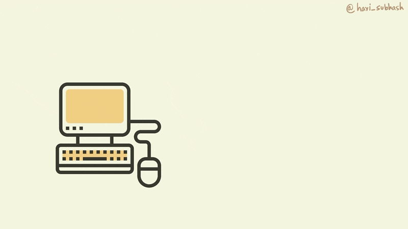
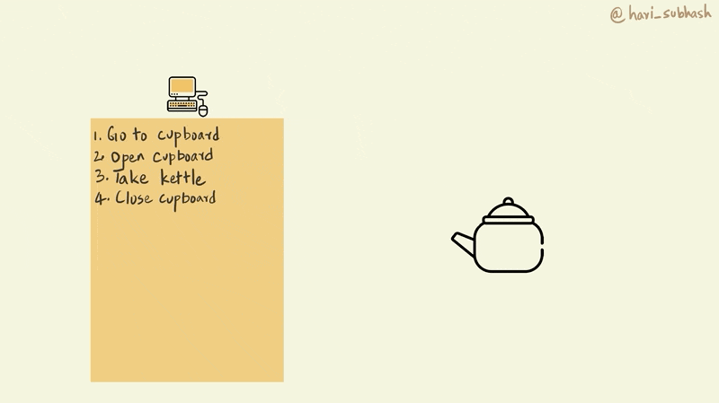
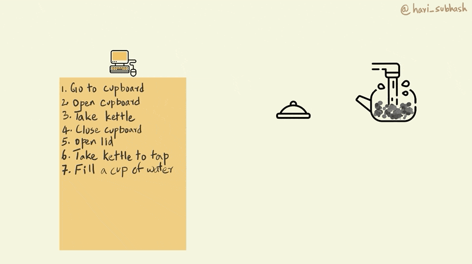
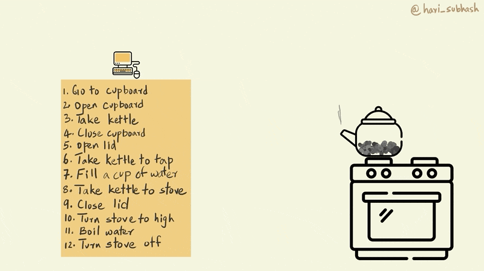
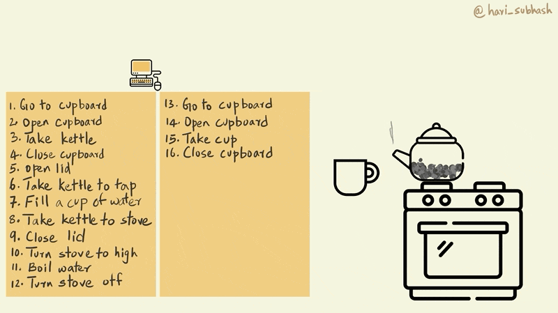
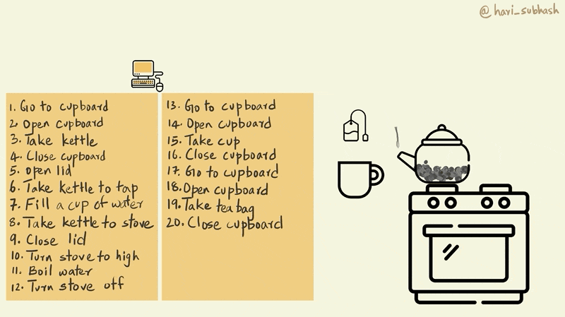
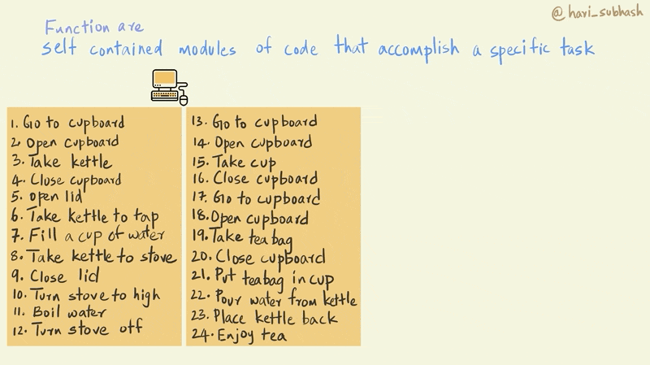
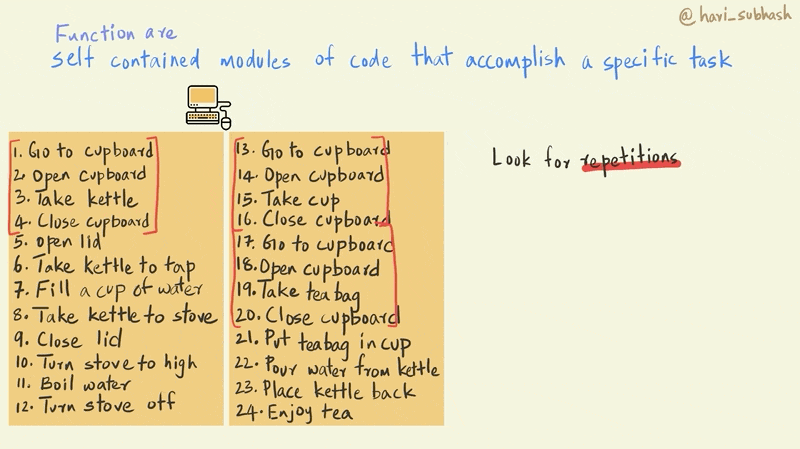
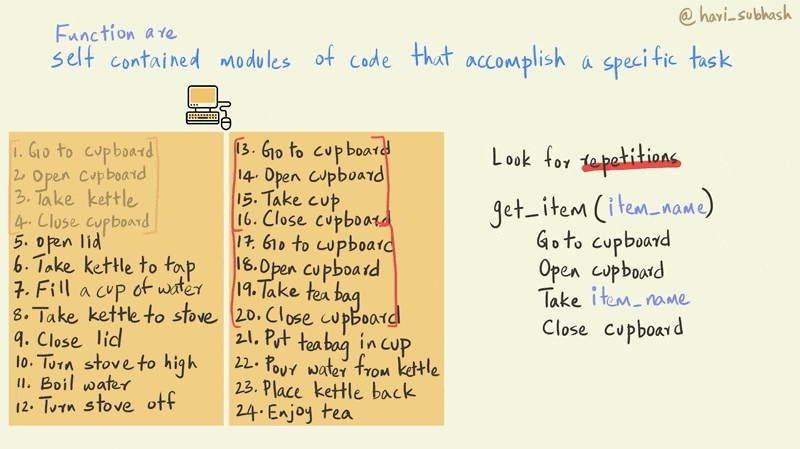
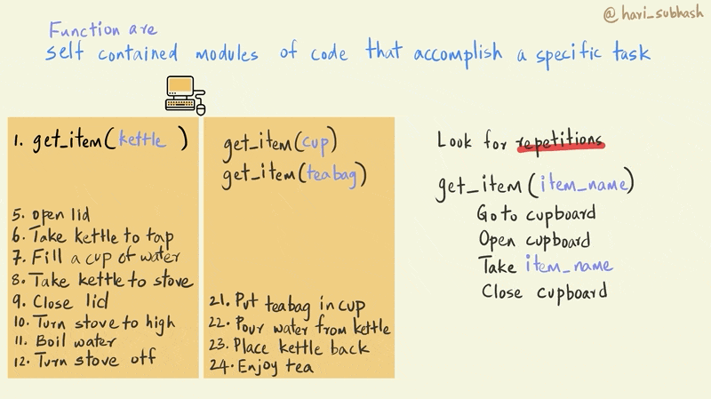

# Introduction to Functions

In chapter @ref(setup) section on \[saving code\] we saw how we could
save a series of programming commands in a script and then source that
script whenever we needed to execute the same sequence. This meant that
we did not have to type out the commands again to execute the series of
steps, instead, we could simply source the script to run the sequence of
steps for us.

Functions are a similar concept in programming but with the additional
feature of being able to pass certain values as arguments that determine
the nature of the output.

For instance, consider the following function `sum(32, 15)`. `sum` is
the name of the function and `32` and `15` are the arguments that were
passed to the function. If we changed the values of the arguments to
some other numbers then the output of the sum function would change
accordingly.

We’d similarly used the `print` function earlier with the argument
`"Hello World"`. In programming terminology, whenever we use a function
in our code it is referred to as being called with its arguments. Here
we called the function print with the argument “Hello World”.

Functions are an extremely powerful tool for programming and have a lot
of different benefits.

Well named functions enhance the readability of your code by declaring
to the reader what it is that you are doing. When a programmer uses
functions like `sum` or `print`, the reader clearly understands what
they are seeking to achieve. This is in contrast with a series of
commands that implement the nitty-gritty details of adding two numbers
or printing something to the console, which often are confusing to
someone else who is not necessarily familiar with the logic behind the
detailed steps.

By encapsulating a series of steps in a function, you also reduce the
likelihood errors that could occur if you had to copy and paste the same
set of commands in different places in your code. Eliminating the need
to copy paste commands also makes your code much easier to manage, since
if you realize you have to modify a particular command you only have to
do it within the function definition, whereas if you did not use a
function, you would have to find all the places where that command
appears and then change all those instances.

## An illustration

Let’s explore why functions are useful and how to go about building them
by teaching a computer to make tea. Imagine this computer is sending
these instructions to a robot.

Now, asking your computer to make tea is very different from say asking
a friend of yours to make you tea.

Your friend doesn’t need step by step instructions to make tea. In fact
your friend would probably think that you were crazy if you told them
something like “put the kettle on the stove and wait for the water to
come to a boil and then open the cupboard to get a cup”. You would
instead simply declare, make me some tea (please). Much like you
declared print “Hello World” for me.

Unlike your friend a computer needs very precise step by step
instructions to make tea. So let’s look at two ways to provide this
instruction. One without functions and another using functions.

Let’s start by turning on our computer and asking it to boil some water
for the tea.

First you need to get the kettle from your cupboard.This would involve
going to the cupboard, opening it, and then pulling out the kettle from
the cupboard and then closing the cupboard.

Now we need to take the kettle to the tap and fill enough water for a
cup.

Next let’s give all the instructions to boil this water.

Now that we have boiling water, we need to go back to the cupboard to
get a cup to pour the water into.

Now, the only thing missing is a tea bag. Let’s go back to the cupboard
to fetch that as well.

Now we need to place the teabag in the cup and pour the water in.

Enjoy your tea!

## The function way

Functions can be defined as follows \[@function_def\]

> Functions are self contained modules of code that accomplish a
> specific task

So how do we recognize when to use a function in our code???

The biggest hint that you can get for using a function is when you
notice yourself copying and pasting code from one part of your script or
notebook to another. This is usually a signal to stop and consider if it
is worth the effort to encapsulate that particular sequence into a
function. For instance, in our series of steps for the computer, the
sequence where we go to the cupboard to fetch something is repeated and
can be replaced with a function.

Let’s create a function called get_item that takes the item that we
would like to get from the cupboard as its argument. Notice how in the
function definition, for step 3, where the computer needs to take a
particular item, we use `item_name` instead of a specific item like a
kettle or a cup as we did previously. This is the key design feature of
functions that allows us to use it repeatedly with different parameters.

Now we can replace all the repeated cupboard sequences with our
`get_item()` function. And instead of the item_name, we use the name of
the specific item that we would like to fetch from the cupboard and
internally the function will replace item_name with the name of the item
that we pass as an argument for the function. So get_item(“cup”) will
fetch a cup from the cupboard.

Now that we have replaced the repeated sections, we can clean up our
code a little bit. The code is now much smaller and easier to
understand. 

## More functions

Now imagine if you were instead teaching the computer to cook. And
making tea was one of the many other things that are included in this
huge program. Some of the sequences in making tea, such as that for
boiling water or putting an item into a vessel etc. are also likely to
be repeated elsewhere. How would you write a function to encapsulate
these actions?
