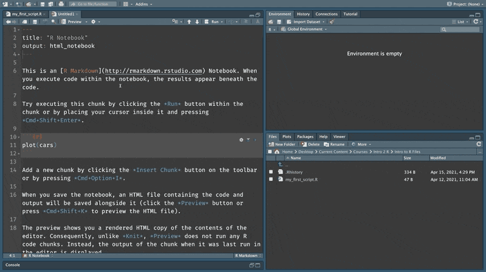
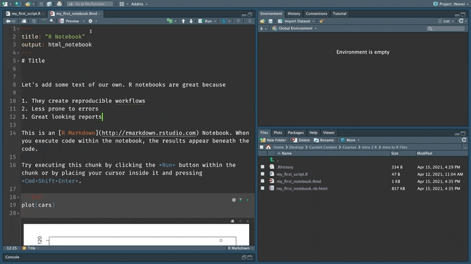

# The magical world of notebooks

In \@ref(setup) section on [saving code] we wrote some code and saved it in an R Script file. Scripts are great for saving code that you would like to execute multiple number of times. They make it much easier to write and maintain code. But they have a limitation - they are not suited for interactively exploring data.

A significant portion of data science projects are spent exploring and making sense of the data. This can often require weaving text together with the code and its output. You would also want to share your work with your colleagues and being able to think out aloud in your documents while also presenting the code and its outputs makes your work easy to understand and replicate. Scripts don't allow us to do this effectively but notebooks do.

"An R Notebook is an R Markdown document with code chunks that can be executed independently and interactively, with output visible immediately beneath the input" [@xie2019]. This chapter will explore the basic features of notebooks and how to use them.

## The anatomy of a notebook

RStudio might ask you to install a few packages if this is the first time you are doing this. Go ahead and click yes.

```{r echo=FALSE}
knitr::include_graphics("assets/ch_2-notebooks/gifs/open_notebook.gif")
```

As mentioned earlier, R notebooks are a type of R markdown document. This book for instance, is also written in R markdown and is a type of R markdown document. An R markdown document is composed of the following components.

1.  **YAML**: At the top, we have a YAML header. YAML stands for Yet Another Markup Language. YAML is used to set the metadata for a R markdown document. For instance, here it sets the title of the notebook and specifies that the output format is an `html_notebook`. The YAML portion of the document is identified by the three `---` at the top and bottom. You will not have to worry about YAML much in the beginning since RStudio conveniently pre-populates it when you open a new R markdown document. However, as you get along on your R journey, you will learn how to use this header section to customize the look and feel of your documents.
2.  **Markdown**: The next piece of an R markdown document is markdown. Markdown is a text markup language. Markup is simply annotations next to text that instruct the editor to render the text a particular way. For instance, `##` next to some text would indicate that the particular line of text should be rendered as a type 2 heading. This is similar to what you would do in a word processor where you would use the drop down to select a particular heading type. The only difference being that in an editor like MS Word the changes are instantaneously visible to the person who is writing, while with markdown you will only be able to see the changes when you render.
3.  **Code**: You can insert new chunks of code into your notebooks using `Ctrl + Alt + I` or `CMD + Opt + I` in Mac. Whilw we will be primarily using R code, you could insert chunks of code in other languages like Python, C++, SQL also.

```{r echo=FALSE}

```

## The basics

Give the document a name, hit save and preview it.

```{r echo=FALSE}
knitr::include_graphics("assets/ch_2-notebooks/gifs/save_preview.gif")
```

The preview immediately launches the notebook in a different window showing the text along with the code.

Also notice, how the file section in R Studio now has two files. One that has the extension `.Rmd` indicating an R markdown file and another with the extension `.nb.html` indicating an HTML notebook, which is the output format that is in the YAML header.

```{r echo=FALSE}
knitr::include_graphics("assets/ch_2-notebooks/gifs/two_files.gif")
```

Under the hood when you 'knit' an Rmarkdown notebook it is handed off to the package knitr [@R-knitr] , which executes all the code chunks and spins up an intermediate markdown document. This document is then sent to a open source converter called pandoc that converts the markdown document to the format that is set in the YAML header. [@hadley2017]

```{r echo=FALSE}

```

The preview updates whenever we make any changes to the notebook and save it. Let's see it in action. We can run a chunk of code by pressing the play button. This chunk of code generates a plot that is rendered below it. When we save the document and go back to the preview you will notice that it is automatically updated.

```{r echo=FALSE}
knitr::include_graphics("assets/ch_2-notebooks/gifs/preview_updates.gif")
```

Let's update some markdown text as well to see how that renders. I am going to create a type one header. The number of `#` indicate the level of a header in markdown. Once saved the preview will now show the title styled as type one heading.

```{r echo=FALSE}
knitr::include_graphics("assets/ch_2-notebooks/gifs/title_updates.gif")
```

Let's add some more text for fun.

```{r echo=FALSE}
knitr::include_graphics("assets/ch_2-notebooks/gifs/text_fun.gif")
```

If you click on the preview dropdown, you will also notice all these other output formats that you could knit into. Try out the pdf option.

```{r echo=FALSE}

```

Keep this [cheatsheet](https://www.rstudio.com/wp-content/uploads/2015/03/rmarkdown-reference.pdf) as you use this book.
