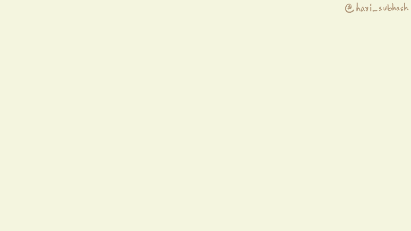

# R basics

## Variables
So far we have used R pretty much like a glorified calculator than can perform calculations and print stuff on to the console. The results from these calculations however were not stored anywhere. However, often times we will need to do more complicated things that require us store intermediate results. We can do so using variables. Copy and run the code shown below

```{r eval=FALSE}
my_awesome_variable <- "R is amazing"
```

## Data types
Don't cover factors? Do we need this here right now? I could potentially cover this much later along with data structures.

1. Character

## Functions
In chapter \@ref(setup) section on [saving code] we saw how we could save a series of programming commands in a script and then source that script whenever we needed to execute the same sequence. This meant that we did not have to type out the commands again to execute the series of steps, instead, we could simply source the script to run the sequence of steps for us.

Functions are a similar concept in programming but with the additional feature of being able to pass certain values as arguments that determine the nature of the output.

For instance, consider the following function `sum(32, 15)`. `sum` is the name of the function and `32` and `15` are the arguments that were passed to the function. If we changed the values of the arguments to some other numbers then the output of the sum function would change accordingly.

We'd similarly used the `print` function earlier with the argument `"Hello World"`. In programming terminology, whenever we use a function in our code it is referred to as being called with its arguments. Here we called the function print with the argument "Hello World".

```{r echo=FALSE}

```

Functions are an extremely powerful tool for programming and have a lot of different benefits.

Well named functions enhance the readability of your code by declaring to the reader what it is that you are doing. When a programmer uses functions like `sum` or `print`, the reader clearly understands what they are seeking to achieve. This is in contrast with a series of commands that implement the nitty-gritty details of adding two numbers or printing something to the console, which often are confusing to someone else who is not necessarily familiar with the logic behind the detailed steps.

By encapsulating a series of steps in a function, you also reduce the likelihood errors that could occur if you had to copy and paste the same set of commands in different places in your code. Eliminating the need to copy paste commands also makes your code much easier to manage, since if you realize you have to modify a particular command you only have to do it within the function definition, whereas if you did not use a function, you would have to find all the places where that command appears and then change all those instances.


## Packages
One of the biggest benefits of using an open source language like R is its robust package ecosystem. A package usually contains code, data and documentation.

```{r echo=FALSE}
knitr::include_graphics("assets/packages/gifs/package_open.gif")
```

The code part of a package typically contains a set of functions that we can use in our work. The functions are written and tested by someone else and this means that we don't have to go through the work of writing them ourselves. In fact, almost all of your work will be done using Packages contain a collection of such functions that have been written and tested by someone else.

```{r echo=FALSE}
knitr::include_graphics("assets/packages/gifs/package_fn.gif")
```

### Install the tidyverse package


  

